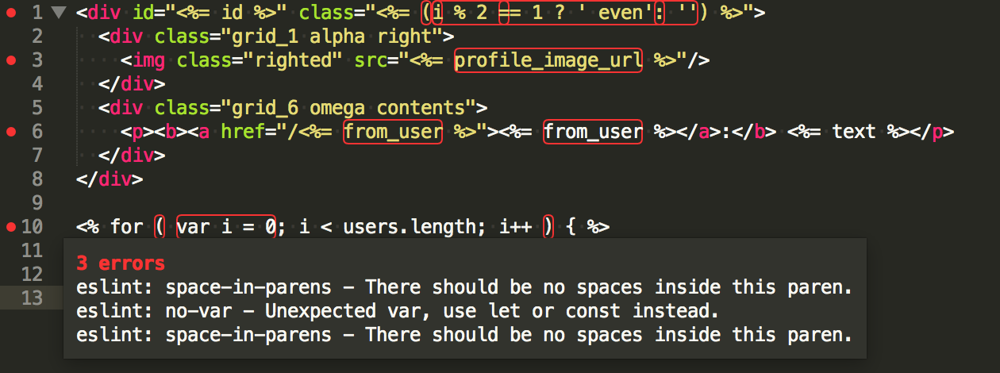

# eslint-plugin-lodash-template

[](https://www.npmjs.com/package/eslint-plugin-lodash-template)
[](https://www.npmjs.com/package/eslint-plugin-lodash-template)
[](http://www.npmtrends.com/eslint-plugin-lodash-template)
[](http://www.npmtrends.com/eslint-plugin-lodash-template)
[](http://www.npmtrends.com/eslint-plugin-lodash-template)
[](http://www.npmtrends.com/eslint-plugin-lodash-template)
[](http://www.npmtrends.com/eslint-plugin-lodash-template)
[](https://travis-ci.org/ota-meshi/eslint-plugin-lodash-template)  

ESLint plugin for John Resig-style micro templating.

It can be used in projects using [Underscore.js](http://underscorejs.org/#template) and [Lodash](https://lodash.com/docs/#template) 's template.


This plugin supports code checking for templates like the examples below.

```html
<div id="<%= id %>" class="<%= (i % 2 == 1 ? ' even': '') %>">
  <div class="grid_1 alpha right">
    "/>
  </div>
  <div class="grid_6 omega contents">
    <p><b><a href="/<%= from_user %>"><%= from_user %></a>:</b> <%= text %></p>
  </div>
</div>
```

```html
<% for ( var i = 0; i < users.length; i++ ) { %>
  <li><a href="<%= users[i].url %>"><%= users[i].name %></a></li>
<% } %>
```

output sample(on SublimeText):



## Installation

```bash
npm install --save-dev eslint eslint-plugin-lodash-template
```

## Usage

Create `.eslintrc.*` file to configure rules. See also: [http://eslint.org/docs/user-guide/configuring](http://eslint.org/docs/user-guide/configuring).

Example **.eslintrc.js**:

```js
module.exports = {
  extends: [
    // add more generic rulesets here, such as:
    // 'eslint:recommended',
    'plugin:lodash-template/recommended'
  ],
  rules: {
    // override/add rules settings here, such as:
    // 'lodash-template/no-warning-html-comments': 'error'
  }
}
```

### Attention

This plugin does special handling for the following rule warnings in the template.

| Rule ID | Process Description |
|:--------|:------------|
| `indent` | Disable warnings |
| `strict` | Disable warnings |
| `no-empty` | Disable warnings |
| `max-statements-per-line` | Disable warnings |
| `padded-blocks` | Disable warnings |
| `no-implicit-globals` | Disable warnings |
| `no-unused-expressions` | Disable warnings within interpolate(<%=...%>) |
| `no-multi-spaces` | Disable warnings within interpolate(<%=...%>) |
| `quotes` | Disable warnings if doublequote is set |

## Configs

This plugin provides four predefined configs:
- `plugin:lodash-template/base` - Settings and rules to enable correct ESLint parsing
- `plugin:lodash-template/best-practices` - Above, plus rules to improve dev experience
- `plugin:lodash-template/recommended` - Above, plus rules to improve code readability
- `plugin:lodash-template/all` - All rules of this plugin are included

## Rules

The `--fix` option on the command line automatically fixes problems reported by rules which have a wrench :wrench: below.

<!--RULES_TABLE_START-->

### Base Rules (Enabling Correct ESLint Parsing)

Enforce all the rules in this category with: with:

```json
{
  "extends": "plugin:lodash-template/base"
}
```

|    | Rule ID | Description |
|:---|:--------|:------------|
|  | [lodash-template/plugin-option](./docs/rules/plugin-option.md) | support option |

### Best Practices (Improve Development Experience)

Enforce all the rules in this category and all the rules in `Base` category with: with:

```json
{
  "extends": "plugin:lodash-template/best-practices"
}
```

|    | Rule ID | Description |
|:---|:--------|:------------|
|  | [lodash-template/no-empty-template-tag](./docs/rules/no-empty-template-tag.md) | disallow empty micro-template tag. (ex. :ng: `<% %>`) |
|  | [lodash-template/no-html-comments](./docs/rules/no-html-comments.md) | disallow HTML comments. (ex. :ng: `<!-- comment -->`) |
|  | [lodash-template/no-warning-html-comments](./docs/rules/no-warning-html-comments.md) | disallow specified warning terms in HTML comments. (ex. :ng: `<!-- TODO:task -->`) |

### Recommended (Improve Readability)

Enforce all the rules in this category and all the rules in `Base`/`Best Practices` categories with: with:

```json
{
  "extends": "plugin:lodash-template/recommended"
}
```

|    | Rule ID | Description |
|:---|:--------|:------------|
| :wrench: | [lodash-template/template-tag-spacing](./docs/rules/template-tag-spacing.md) | enforce unified spacing in micro-template tag. (ex. :ok: `<%= prop %>`, :ng: `<%=prop%>`) |

### Uncategorized

|    | Rule ID | Description |
|:---|:--------|:------------|
| :wrench: | [lodash-template/html-indent](./docs/rules/html-indent.md) | enforce consistent HTML indentation |
|  | [lodash-template/prefer-escape-template-interpolations](./docs/rules/prefer-escape-template-interpolations.md) | prefer escape micro-template interpolations. (ex. :ok: `<%- ... %>`, :ng: `<%= ... %>`) |

<!--RULES_TABLE_END-->

## Plugin Option

### Suppress `no-undef` warnings in the template tag

Please set the global variable used in all templates as follows.

**.eslintrc.json**:

```diff
  {
      "rules": {
+         "lodash-template/plugin-option": [2, {
+             "globals": ["variableName"],
+         }]
      }
  }
```

Please write the global comment in the file as follows for the variable to be used with a specific template.

```diff
+ <% /* global users */ %>
  <% for ( var i = 0; i < users.length; i++ ) { %>
    <li><a href="<%= users[i].url %>"><%= users[i].name %></a></li>
  <% } %>
```

### Suppress reports for specific rules in template files

Please set as follows.

**.eslintrc.json**:

```diff
  {
      "rules": {
+         "lodash-template/plugin-option": [2, {
+             "ignoreRules": ["no-undef", "no-tabs"],
+         }]
      }
  }
```

The ESLint standard suppression method can also be used by using template tag, as follows.

```diff
+ <% /* eslint no-ternary: 0 */ %>
```

### Customize parser

For example, if you set [Lodash `templateSettings`](https://lodash.com/docs/#templateSettings) as follows,

```js
_.templateSettings = {
    evaluate:    /{{([\s\S]+?)}}/g,
    interpolate: /{{=([\s\S]+?)}}/g,
    escape:      /{{-([\s\S]+?)}}/g
};
```

please set `parserOptions`(ex. **.eslintrc.js**) as follows.

```diff
      parserOptions: {
+         templateSettings: {
+             evaluate:    ["{{", "}}"],
+             interpolate: ["{{=", "}}"],
+             escape:      ["{{-", "}}"],
+         },
      },
```

## License

See the [LICENSE](LICENSE) file for license rights and limitations (MIT).
